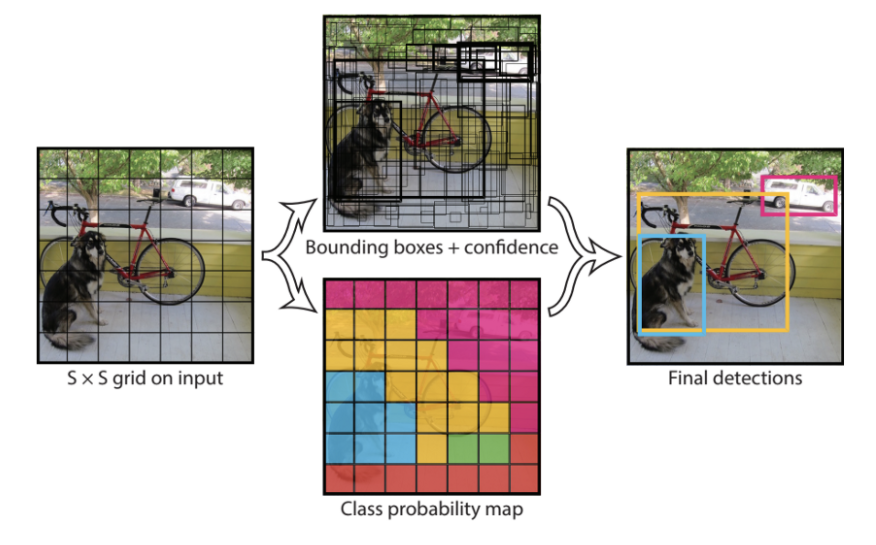
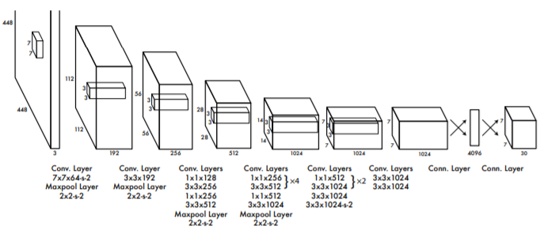
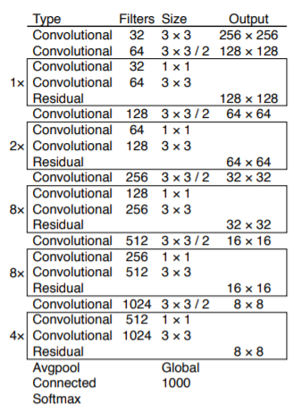
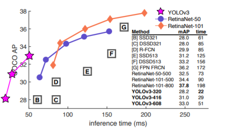
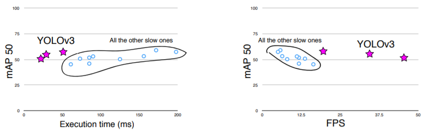

# Real-time People Detection
The goal of this work was to write code for real-time people detection where the video flow is streamed by webcam. 

The principal problem to solve was understand how to make the detections. There are a lot of pretrained R-CNN, Fast R-CNN and Faster R-CNN that have demonstrated good performance. In our scenario, working on real-time video flow, the most important aspect on which get focus is speed. \
A Faster R-CNN (such as Faster R-CNN Inception ResNet V2 trained on COCO 2017 dataset) may seem a good choice, in fact it's faster then R-CNN and Fast R-CNN, but it's not fast enough for processing frames of a streaming session and return the result in reasonable time. \
A smarter choice is insted to use a YOLOv3 whose detection speed  is accetable for real-time detection. 

The code has been written on [Google Colab](https://colab.research.google.com/notebooks/intro.ipynb). Working on a virtual machine provided by Google Cloud Platform it's not necessary install the libraries and packages on your local machine and you can use a GPU for free for expensive computations in term of time, such as those that might occur in a computer vision field. In addition, jupyter notebook guarantees greater portability.


## Table of Contents
- [Brief introduction to YOLO](#Brief-introduction-to-YOLO)

- [What's new in YOLOv3](#Whats-new-in-YOLOv3)

- [Real-time Detection on Google Colab](#real-time-detection-on-Google-Colab)

- [Pedestrian Detection](#pedestrian-detection)

- [References](#References)

# Brief introduction to YOLO
YOLO (You Only Look Once) real-time object detection algorithm, is one of the most effective object detection algorithms. Object detection is an area of computer vision that's exploding in this last years. \
YOLO came on the computer vision scene with the 2015 paper by Joseph Redmon et al. *“You Only Look Once: Unified, Real-Time Object Detection”* and immediately got a lot of attenction by computer vision researchers. 

In object detection field you work to recognize *what* and *where* specific object are in a given image. This problem is more complex than classification, where you can also recognize object but it's not indicated where the object is located in the image.

All type of R-CNN use regions to localize objects, the network don't look at the complete image. YOLO uses a totally different approach. YOLO is a clever convolutional neural network (CNN) for doing object detection in real-time.  The algorithm applies a single neural network to the full image, and then divides the image into regions and predicts bounding boxes and probabilities for each region. These bounding boxes are weighted by the predicted probabilities.

 <p align="center"></p>

The algorithm *"only looks ones"* must be understood in the sense that it requires only one forward propagation pass through the neural network to make predictions. After non-max suppression (which makes sure the object detection algorithm only detects each object once), it outputs the bounding boxes of the recognized objects.
With YOLO, a single CNN simultaneously predicts multiple bounding boxes and class probabilities for those boxes, this makes YOLO really fast (base network proposed in the first version of the project runs at 45 frames per second with no batch processing on a Titan X GPU and a fast version runs at more than 150 fps. This
means we are able to process streaming video in real-time with
less than 25 milliseconds of latency).

## Network design
The model is implemented as a convolutional neural network. The initial layers extract features from the image while the fully connected layers predict the output probabilities and coordinates.\
The network is inspired by the GoogLeNet model for image classification. The network has 24 convolutional layers followed by 2 fully connected layers. It use 1 x 1 reduction layers followed by 3 x 3 convolutional layers. The final output of the network is the 7 x 7 x 30 tensor of predictions.

<p align="center"></p>

## Limitations of YOLO
YOLO imposes strong spatial constarints of bounding box predictions since each grid cell only predicts two boxes and can only have one class. This constrain limits the number of nearby objects that the model can predict. The performance of this architecture are not so good with small objects, especially if they appear in groups. This occurs because the loss function treats errors the same in small bonding boxes and in large bounding boxes. A small error in large box is generally bening but a small error in a small box has a much greater effect on IOU.

# What's new in YOLOv3
Recently the  researchers Redmon and Farhadi presented in their 2018 paper *"YOLOv3: An Incremental Improvement”* a new faster version of YOLO. \
This new version include a new network for performing feature extraction consisting of 53 convolutional layers, a new detection metric, predicting an “objectness” score for each bounding box using logistic regression, and using binary cross-entropy loss for the class predictions during training. The end result is that YOLOv3 runs significantly faster than other detection methods with comparable performance. In addition, YOLO no longer struggles with small objects.


|YOLOv3 architecture | Speed vs Accuracy comparison|
|:------------------:|:---------------------:|
|<p align="center"></p>| <p align="center"></p>|


YOLOv3 is a good detector. It’s fast, it’s accurate. It’s
not as great on the COCO average AP between .5 and .95
IOU metric. But it’s very good on the old detection metric
of .5 IOU.

<p align="center"></p>

I want to report on this relation a quote from the paper that i find interesting and above all very topical, where the researchers reflect what computer vision can be used for today

>*"What are we going to
do with these detectors now that we have them? A lot of
the people doing this research are at Google and Facebook.
I guess at least we know the technology is in good hands
and definitely won’t be used to harvest your personal information and sell it to.... wait, you’re saying that’s exactly
what it will be used for?? Oh.
Well the other people heavily funding vision research are
the military and they’ve never done anything horrible like
killing lots of people with new technology oh wait...
I have a lot of hope that most of the people using computer vision are just doing happy, good stuff with it, like
counting the number of zebras in a national park, or
tracking their cat as it wanders around their house. But
computer vision is already being put to questionable use and
as researchers we have a responsibility to at least consider
the harm our work might be doing and think of ways to mitigate it"*

# Real-time Detection on Google Colab
YOLOv3 is able to detection multiple objects at the same time. In this specific work i've focused the attention only on people detection.

`PeopleDetection_YOLOv3_streamingWebcam.ipynb` is the jupyter notebook where the code and its explanation is located.\
To run it you need to log in with your Google account [](https://colab.research.google.com/github/stegianna/AI_project/blob/master/PeopleDetection_YOLOv3_streamingWebcam.ipynb) 


It is strongly recommended to use the gpu as accelerator. To do this `Go to Menu > Runtime > Change runtime`. Change hardware acceleration to GPU. \
Once the execution has started, it is necessary to give to browser the permission to access the webcam.

# Pedestrian Detection
After seen how to detect people in real-time where the video flow is streamed by a webcam, it's easy to ask this question: "In what scenario can this technology be useful?". \
I can imagine a city surveillance system that detects pedestrians where the video flow is streamed by an IP camera connected to the network. 

I think it's interesting to see how we can take frames, process and show them with the detected bounding boxes. \
Using part of the code previously used and `openCV` libraries, it's possible to do it. Unfortunately show the output in Google Colab it's complicated becuase JS code should be added. \
I decided so to put below the part of code that would guarantee to do this locally

```python
import numpy as np
import cv2

URL = ""        #IP camera URL
cap = cv2.VideoCapture(URL)

while(True):
    # Capture frame-by-frame
    ret, frame = cap.read()

    # Display the resulting frame
    cv2.imshow('frame',frame)
    if cv2.waitKey(1) & 0xFF == ord('q'):
        break

# When everything done, release the capture
cap.release()
cv2.destroyAllWindows()
```

Obviously in the while loop, before showing the captured frame, it must be processed by YOLOv3. 

We know from literature that YOLOv3 works well. I wanted to try it out, testing it on a short video. 

In `PedestrianDetection_YOLOv3.ipynb` there is the code used to do it. [](https://colab.research.google.com/github/stegianna/AI_project/blob/master/PedestrianDetection_YOLOv3.ipynb)

The tested video is a video cut taken from [VIRAT Video Dataset](https://viratdata.org/).

# References
For YOLO and YOLOv3 theoretical concepts
- [Overview of the YOLO Object Detection Algorithm](https://medium.com/@ODSC/overview-of-the-yolo-object-detection-algorithm-7b52a745d3e0)
- [R-CNN, Fast R-CNN, Faster R-CNN, YOLO — Object Detection Algorithms](https://towardsdatascience.com/r-cnn-fast-r-cnn-faster-r-cnn-yolo-object-detection-algorithms-36d53571365e)
- Joseph Redmon et al. *You Only Look Once: Unified, Real-Time Object Detection*
- J. Redmon and A. Farhadi. *Yolov3: An incremental improvement*

For the code
- https://github.com/ultralytics/yolov3
- https://learn.adafruit.com/tensorflow-in-your-browser-object-detection-with-bounding-boxes?view=all
- https://stackoverflow.com/questions/33134985/cv2-videowriter-will-not-write-file-using-fourcc-h-264-with-logitech-c920-pyth
- https://stackoverflow.com/questions/57377185/how-play-mp4-video-in-google-colab

